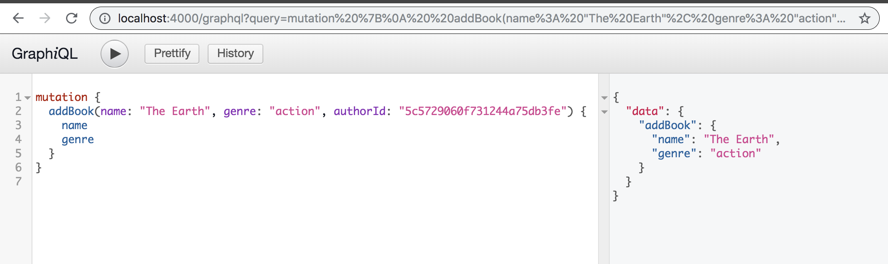

# Backend

### express-graphql
> Express needs this package so it understands it.
### graphql
> GraphQL.js provides two important capabilities: building a type schema, and serving queries against that type schema.

### localhost:400 -
>  to start npm run dev.

### http://localhost:4000/graphql
> However we need to pass


### We need to use double qoutes if it is a string
```graphql
{
  book(id: "1"){
    name
    genre
    id
  }
}
```

### We can also get the author from the book that we requested
```graphql
{
  book(id: 2) {
    name
    genre
    author{
      name
      age
      id
    }
  }
}
```

### We can also get the books for a specific author

```graphql
{
  author(id: 3) {
    name
    age
    books{
      name
      id
    }
  }
}
```
### we can also get all the books

>   because we have done the relationship between the books and the author. This will get you all the books and their authors

```graphql
{books {
  id
  name
  genre
  author{
    name
    age
  }
}}
```


### we can also get all the authors
>  because we have done the relationship between the books and the author. This will get you all the books for each author
```graphql
{
  authors {
    name
    age
    books{
      name
    }
  }
}
```

### MLAB -

> first you need to create a user and then connect it to mongoose
khaledkzy:emp123

### Mutation
>  means changing the data (Add authors, delete authors)


### The collection before the mutation


### The collection after the mutation

```graphql
mutation {
  addAuthor(name: "Khaled", age: 25){
    name
    age
  }
}
```


### Inside mlab collection

> we can get the id from there


```graphql
mutation {
  addBook(name: "The Earth", genre: "action", authorId: "5c5729060f731244a75db3fe") {
    name
    genre
  }
}
```



```graphql
{
  books{
    name
    genre
    author{
      name
      age
    }
  }
}
```


```graphql
mutation {
  updateAuthor(id: "5c572fed00b4ee480573f3c4", name: "Khaled Zaki", age: 55 ) {
    name
    age
  }
}
```


# Front End

### React

> Make a folder called client and run ```npx create-react-app``` .
### Apolo
